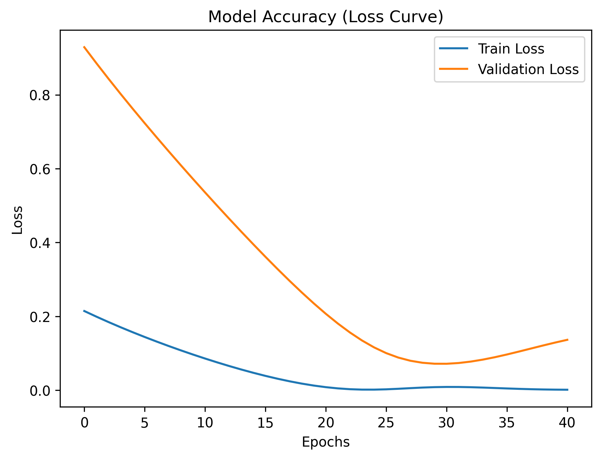

🐟 AI-Powered Fish Supply Chain Risk Detection
Hybrid Bat Algorithm (BA) + Particle Swarm Optimization (PSO)
📌 Project Overview

Fish supply chains are highly sensitive to transport delays, demand fluctuations, and environmental uncertainty. Unexpected disruptions can lead to financial loss, spoilage, and export failure.

This project proposes an AI-powered risk detection system using a hybrid Bat Algorithm (BA) + Particle Swarm Optimization (PSO) approach combined with LSTM-based time-series forecasting to quantify route-level supply risk.

🎯 Objectives

Predict supply-chain risk using historical export data

Capture temporal trends using LSTM

Optimize risk threshold using hybrid BA + PSO

Generate route-wise risk scores

Produce interpretable outputs (graphs, CSV, JSON, YAML)

🧠 Model Architecture
Input CSV Data
      ↓
Data Preprocessing & Scaling
      ↓
LSTM Time-Series Prediction
      ↓
Bat Algorithm (Global Search)
      ↓
Particle Swarm Optimization (Local Refinement)
      ↓
Optimized Risk Threshold
      ↓
Risk Score Generation (0–1)

🤖 Why Hybrid BA + PSO?
Algorithm	Role
LSTM	Learns temporal export patterns
Bat Algorithm (BA)	Global exploration of risk threshold
PSO	Fast local convergence
Hybrid Output	Stable & optimized risk detection

This hybrid design avoids local minima and improves risk separation quality.

📂 Dataset Used
ExportoffishandfishproductsinTN_0.csv

Source:
Government export statistics (Tamil Nadu)

Features:
Automatically selected numeric columns (export volume, value, trends)

⚙️ Technology Stack

Python 3.9+

TensorFlow / Keras

Scikit-Learn

NumPy / Pandas

Matplotlib / Seaborn

Joblib

PyYAML

📁 Project Directory Structure
Fish Supply Chain Risk Detection/
│
├── bso_lstm_model.h5
├── bso_scaler.pkl
├── bso_risk_results.csv
├── bso_prediction_summary.json
├── bso_config.yaml
│
└── bso_graphs/
    ├── bso_accuracy_graph.png
    ├── bso_comparison_graph.png
    ├── bso_heatmap.png
    └── bso_risk_score_graph.png

📊 Outputs Explained
1️⃣ Accuracy Graph

Training vs validation loss

Evaluates LSTM convergence

2️⃣ Comparison Graph

Actual vs predicted values

Verifies prediction stability

3️⃣ Heatmap

Correlation between actual, predicted & risk score

4️⃣ Risk Score Graph

Route-wise risk visualization

Threshold line at 0.8

📈 Risk Interpretation
Risk Score	Meaning
< 0.5	Low Risk
0.5 – 0.8	Medium Risk
> 0.8	High Risk (Critical)
🧪 How the Risk Score Is Computed
Risk Score = Predicted Value / Optimized Threshold

Threshold is optimized using BA → PSO

Scores are normalized to [0,1]

▶️ How to Run the Project
Step 1: Install Dependencies
pip install pandas numpy scikit-learn matplotlib seaborn tensorflow pyyaml joblib

Step 2: Run the Script
python bso_ba_pso_fish_supply_chain.py

📦 Files Generated
File	Description
bso_lstm_model.h5	Trained LSTM model
bso_scaler.pkl	Feature scaler
bso_risk_results.csv	Route-wise risk scores
bso_prediction_summary.json	Key metrics
bso_config.yaml	Model configuration
bso_graphs/*.png	Visual outputs
🚀 Use-Cases

Fish exporters & cooperatives

Cold-chain logistics providers

Export risk insurance agencies

Port authority planning

Government trade analytics

🔮 Future Enhancements

Geo-spatial route risk mapping

Real-time IoT sensor integration

Triple hybrid optimization (BA + PSO + AIS)

Risk classification using ML classifiers

Web dashboard deployment

🧑‍💻 Author

Sagnik Patra
AI / ML Research & Optimization Systems
